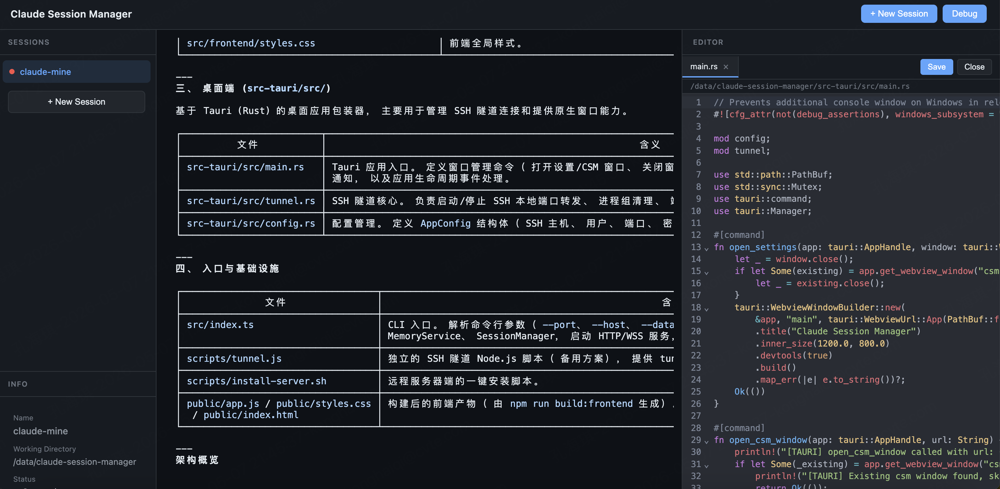
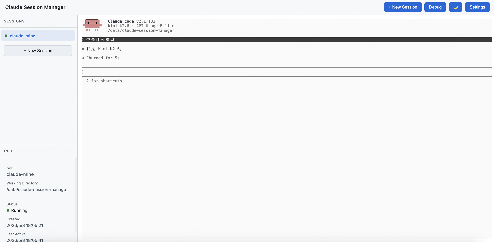

# Claude Session Manager (CSM)

在浏览器中远程管理 Linux 服务器上的 Claude Code 会话。




## 功能特性

- **多会话管理** — 同时维护多个独立的 Claude Code 会话，每个会话有独立的工作目录和对话上下文
- **Web 终端** — 基于 xterm.js 的完整终端模拟器，支持彩色输出、文件路径点击跳转
- **内联代码编辑器** — 点击终端中的文件路径即可在侧边栏打开 CodeMirror 编辑器，直接修改远程文件
- **会话持久化** — 服务器重启后会话列表自动恢复，支持 `claude --resume` 恢复到之前的对话
- **SSH Tunnel CLI** — 轻量 Node.js 脚本自动管理 SSH 隧道，断线自动重连
- **实时通知** — Claude 回复完成后自动发送浏览器通知

## 设计特点

### 终端
- 内置 One Dark / One Light 两套主题，字体大小可在 10–22px 之间调节，最小对比度设置为 4.5
- 终端输出的文件路径通过自定义 LinkProvider 识别为可点击链接，支持绝对路径、相对路径以及带空格的路径（引号包裹）
- 每个会话维护一个 500 行的输出缓冲区，WebSocket 断线重连后自动向客户端回放，避免内容丢失

### 代码编辑器
- CodeMirror 6 侧边栏编辑器支持多标签页，标签显示未保存标记，关闭前提示确认
- 按文件扩展名自动加载对应语言包，目前支持 TypeScript、JavaScript、Rust、Python、JSON、HTML、CSS、Markdown、C/C++、Shell、SQL
- 支持 Cmd+S / Ctrl+S 保存，主题随全局设置同步切换深色/浅色

### 连接稳定性
- WebSocket 层实现 35 秒心跳超时检测，客户端断开后按退避策略自动重连
- Tunnel CLI 每 10 秒对本地端口执行 HTTP 健康检查，连续 2 次失败后自动重建 SSH 隧道，重试间隔按指数退避增长（2s → 4s → 8s… 最大 60s）
- PTY 进程在最后一个客户端断开时保持运行，新客户端连接后可直接恢复交互，无需等待进程重启

### 安全
- 服务端可选 Basic Auth，通过环境变量或启动参数配置
- 文件读写 API 对请求路径做 `path.resolve` 规范化，拒绝非绝对路径，防止目录遍历
- 读取文件时采样前 8KB 内容检测空字节，判定为二进制则拒绝编辑；单文件编辑上限 1MB，上传上限 10MB
- Tunnel CLI 默认启用 `StrictHostKeyChecking=accept-new`、`ServerAliveInterval=30`、`TCPKeepAlive=yes` 等 SSH 参数

### 部署方式
- 提供 Docker 镜像，支持数据卷挂载持久化
- 可作为 systemd 用户服务运行，普通用户即可配置开机自启
- 浏览器直接访问，无需安装额外客户端

### 会话生命周期
- 会话状态分为 `running`（有客户端连接）、`disconnected`（无客户端但 PTY 进程仍在）、`stopped`（PTY 已退出）三种
- 会话元数据、最后活跃时间戳、Claude session ID 通过 SQLite 持久化，服务端重启后自动加载恢复
- 首次启动 PTY 时异步读取 `~/.claude/sessions/<pid>.json` 获取 Claude 内部 session ID，用于后续 `claude --resume`；若 resume 后进程在 3 秒内退出，则判定 session ID 已失效，清空后重新启动新会话

## 架构

```
┌─────────────────────────────────────────────────────────────┐
│  Mac / Linux / Windows (Browser)                            │
│  ┌─────────────────────────────────────────────────────┐   │
│  │ Frontend (xterm.js + CodeMirror 6)                  │   │
│  │  - Session list sidebar                             │   │
│  │  - Terminal panels (WebSocket → PTY)              │   │
│  │  - Code editor sidebar (multi-tab)                  │   │
│  └─────────────────────────────────────────────────────┘   │
│              ↑ WebSocket / HTTP                              │
│              │ SSH tunnel (CLI auto-manages)                 │
├──────────────┼──────────────────────────────────────────────┤
│  Linux Server│                                              │
│  ┌───────────┴─────────────────────────────────────────┐   │
│  │ CSM Node.js Backend                                 │   │
│  │  - Express REST API (/api/sessions, /api/files)    │   │
│  │  - WebSocket router (input/resize/ping/buffer)     │   │
│  │  - node-pty spawns `claude` process                │   │
│  │  - SQLite persists sessions + output history       │   │
│  └─────────────────────────────────────────────────────┘   │
└─────────────────────────────────────────────────────────────┘
```

## 技术栈

- **Backend**: Node.js 20+, TypeScript, Express, ws (WebSocket), node-pty, better-sqlite3
- **Frontend**: Vanilla TypeScript, xterm.js 5.x, xterm-addon-fit, CodeMirror 6 (ESM CDN)
- **Tunnel Manager**: Node.js CLI, system `ssh` client for port forwarding

## 服务器端部署

### 方式一：Docker（推荐）

```bash
docker run -d \
  --name csm \
  -p 9090:9090 \
  -v csm-data:/root/.csm \
  -v claude-data:/root/.claude \
  haven1999/claude-session-manager:latest
```

> **重要**：必须同时挂载 `csm-data`（CSM 数据库）和 `claude-data`（Claude 会话文件），否则容器重启后会话丢失。

### 方式二：systemd 用户服务

```bash
# 1. 安装全局命令
npm install -g claude-session-manager

# 2. 创建 systemd 用户服务
mkdir -p ~/.config/systemd/user
cat > ~/.config/systemd/user/csm.service << 'EOF'
[Unit]
Description=Claude Session Manager
After=network.target

[Service]
Type=simple
ExecStart=%h/.local/share/fnm/node-versions/v20/bin/csm --host 0.0.0.0
Restart=on-failure
Environment="HOME=%h"

[Install]
WantedBy=default.target
EOF

# 3. 启动并启用
systemctl --user daemon-reload
systemctl --user enable --now csm

# 4. 查看状态
systemctl --user status csm
```

服务器启动后监听 `http://0.0.0.0:9090`。

## Mac 客户端（浏览器 + Tunnel CLI）

### 前置要求

- macOS / Linux / Windows（任何能跑 Node.js 和 SSH 的系统）
- Node.js 20+
- SSH 客户端（macOS/Linux 自带，Windows 可用 Git Bash 或 WSL）

### 安装

```bash
# 1. 克隆仓库
git clone https://github.com/Haven-1999/claude-session-manager.git
cd claude-session-manager

# 2. 安装依赖（仅 tunnel 脚本需要）
npm install
```

### 首次使用

1. **配置 SSH 连接信息**
   ```bash
   npm run tunnel config
   ```
   按提示填写：
   - **SSH Host**: 你的服务器地址
   - **SSH User**: 登录用户名
   - **SSH Port**: 22（默认）
   - **Remote CSM Port**: 9090（服务器端端口）
   - **Local Port**: 18080（本地转发端口，可改）
   - **SSH Identity File**: `~/.ssh/id_rsa`（私钥路径）

2. **启动隧道（前台模式，日志直接输出到终端）**
   ```bash
   npm run tunnel start
   ```

   或 **后台模式（推荐日常使用）**
   ```bash
   npm run tunnel daemon
   ```

3. **浏览器打开 CSM**
   ```bash
   open http://127.0.0.1:18080
   ```

### 常用命令

| 命令 | 作用 |
|------|------|
| `npm run tunnel start` | 前台启动隧道，Ctrl+C 停止 |
| `npm run tunnel daemon` | 后台启动隧道，日志写入 `~/.csm/tunnel.log` |
| `npm run tunnel stop` | 停止后台隧道 |
| `npm run tunnel status` | 查看隧道是否在运行 |
| `npm run tunnel config` | 重新配置 SSH 连接信息 |

### Tunnel CLI 工作原理

1. **启动 SSH 进程**：调用系统 `ssh -N -L` 建立端口转发，带 `ServerAliveInterval=30` 等参数保持连接
2. **健康检查**：每 10 秒用 `HEAD /api/sessions` 检测本地端口是否可用
3. **自动重连**：连续 2 次健康检查失败 → 杀掉旧 SSH 进程 → 清理端口占用 → 重新建立隧道
4. **退避策略**：重建失败后间隔时间指数增长（2s → 4s → 8s… 最大 60s），避免频繁重试

## 使用说明

### 手动 SSH 隧道（不想用 CLI 时）

```bash
ssh -N -L 18080:localhost:9090 user@your-server
open http://127.0.0.1:18080
```

### 创建会话

1. 点击顶部 **+ New Session**
2. 输入会话名称和工作目录（默认 `/tmp`）
3. 终端区域会自动打开 Claude Code，开始对话

### 文件编辑

终端中输出的文件路径（绝对或相对）会自动变成可点击链接：
- 点击绝对路径：`/data/repo/src/main.rs` → 直接打开
- 点击相对路径：`src/wifi/seedpace_sources.c` → 基于当前 session 的 cwd 解析
- 如果文件不存在，会弹出路径确认对话框

### 会话状态

| 状态 | 颜色 | 含义 |
|------|------|------|
| running | 绿色 | 有客户端连接，Claude 进程运行中 |
| disconnected | 黄色 | 无客户端连接，Claude 进程仍在运行 |
| stopped | 红色 | Claude 进程已退出 |

**stopped 的会话可以恢复**：点击后 CSM 会执行 `claude --resume <claude_session_id>` 恢复到之前的对话上下文。

## 开发

```bash
# 启动开发服务器（热重载 TypeScript）
npm run dev

# 另一个终端启动前端构建监听
npm run build:frontend

# 运行测试
npm test

# Tunnel CLI 开发模式
npm run tunnel start
```

## 数据存储

| 路径 | 用途 | 是否必须持久化 |
|------|------|--------------|
| `~/.csm/sessions.db` | CSM 会话列表 + 输出历史 | 是 |
| `~/.claude/sessions/*.json` | Claude CLI 会话元数据 | 是 |
| `~/.csm/tunnel.json` | SSH Tunnel CLI 配置 | 是（仅客户端）|

## 已知问题

1. **xterm.js 初始化** — 容器必须在可见状态下调用 `terminal.open()`，否则退化为纯文本显示
2. **Claude session ID 映射** — CSM UUID 和 Claude 内部 session ID 是独立系统。首次启动时异步读取 `~/.claude/sessions/<pid>.json` 建立映射，如读取超时则本次无法 resume

## License

MIT
