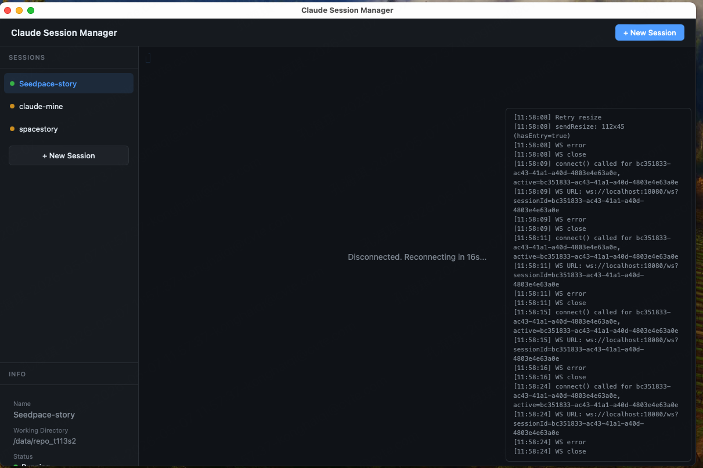

# Claude Session Manager (CSM)

在浏览器或 Mac 桌面 App 中远程管理 Linux 服务器上的 Claude Code 会话。



## 功能特性

- **多会话管理** — 同时维护多个独立的 Claude Code 会话，每个会话有独立的工作目录和对话上下文
- **Web 终端** — 基于 xterm.js 的完整终端模拟器，支持彩色输出、文件路径点击跳转
- **内联代码编辑器** — 点击终端中的文件路径即可在侧边栏打开 CodeMirror 编辑器，直接修改远程文件
- **会话持久化** — 服务器重启后会话列表自动恢复，支持 `claude --resume` 恢复到之前的对话
- **Mac 桌面 App** — Tauri 封装的原生应用，自动管理 SSH 隧道，自带连接向导
- **实时通知** — Claude 回复完成后自动发送系统通知（浏览器 + macOS）

## 架构

```
┌─────────────────────────────────────────────────────────────┐
│  Mac (Tauri App / Browser)                                  │
│  ┌─────────────────────────────────────────────────────┐   │
│  │ Frontend (xterm.js + CodeMirror)                    │   │
│  │  - Session list sidebar                             │   │
│  │  - Terminal panels (WebSocket → PTY)              │   │
│  │  - Code editor sidebar                              │   │
│  └─────────────────────────────────────────────────────┘   │
│              ↑ WebSocket / HTTP                              │
│              │ SSH tunnel (Tauri auto-manages)               │
├──────────────┼──────────────────────────────────────────────┤
│  Linux Server│                                              │
│  ┌───────────┴─────────────────────────────────────────┐   │
│  │ CSM Node.js Backend                                 │   │
│  │  - Express REST API (/api/sessions, /api/files)    │   │
│  │  - WebSocket router (input/resize/ping)            │   │
│  │  - node-pty spawns `claude` process                │   │
│  │  - SQLite persists sessions + output history       │   │
│  └─────────────────────────────────────────────────────┘   │
└─────────────────────────────────────────────────────────────┘
```

## 技术栈

- **Backend**: Node.js 20+, TypeScript, Express, ws (WebSocket), node-pty, better-sqlite3
- **Frontend**: Vanilla TypeScript, xterm.js 5.x, xterm-addon-fit, CodeMirror 6 (CDN)
- **Mac App**: Tauri v2 (Rust), system `ssh` client for port forwarding

## 服务器端部署

### 方式一：Docker（推荐）

```bash
docker run -d \
  --name csm \
  -p 9090:9090 \
  -v csm-data:/root/.csm \
  -v claude-data:/root/.claude \
  haven1999/claude-session-manager:latest
```

> **重要**：必须同时挂载 `csm-data`（CSM 数据库）和 `claude-data`（Claude 会话文件），否则容器重启后会话丢失。

### 方式二：systemd 用户服务

```bash
# 1. 安装全局命令
npm install -g claude-session-manager

# 2. 创建 systemd 用户服务
mkdir -p ~/.config/systemd/user
cat > ~/.config/systemd/user/csm.service << 'EOF'
[Unit]
Description=Claude Session Manager
After=network.target

[Service]
Type=simple
ExecStart=%h/.local/share/fnm/node-versions/v20/bin/csm --host 0.0.0.0
Restart=on-failure
Environment="HOME=%h"

[Install]
WantedBy=default.target
EOF

# 3. 启动并启用
systemctl --user daemon-reload
systemctl --user enable --now csm

# 4. 查看状态
systemctl --user status csm
```

服务器启动后监听 `http://0.0.0.0:9090`。

## Mac App 安装

### 前置要求

- macOS 10.13+
- [Rust](https://rustup.rs/)（用于编译 Tauri）
- Node.js 20+

### 编译步骤

```bash
# 1. 克隆仓库
git clone https://github.com/Haven-1999/claude-session-manager.git
cd claude-session-manager

# 2. 安装依赖
npm install

# 3. 编译前端
npm run build

# 4. 编译 Mac App
npm run tauri:build
```

输出目录：`src-tauri/target/universal-apple-darwin/release/bundle/macos/Claude Session Manager.app`

### 首次使用

1. 双击 `.app` 打开
2. 在 Setup 页面填写 SSH 连接信息：
   - **SSH Host**: 你的服务器地址
   - **SSH User**: 登录用户名
   - **SSH Port**: 22（默认）
   - **Remote CSM Port**: 9090（服务器端端口）
   - **Local Port**: 18080（本地转发端口，可改）
   - **SSH Identity File**: `~/.ssh/id_rsa`（私钥路径）
3. 点击 **Connect**，Tauri 会自动：
   - 启动 `ssh -L` 隧道
   - 等待端口就绪
   - 打开 CSM 主界面

### 切换服务器

点击顶部栏的 **Settings** 按钮，即可回到 Setup 页面修改配置后重新连接。

## 使用说明

### 浏览器访问（无需 Tauri）

如果不需要 Mac App，直接用浏览器访问：

```bash
# 手动建立 SSH 隧道
ssh -N -L 18080:localhost:9090 user@your-server

# 浏览器打开
open http://localhost:18080
```

### 创建会话

1. 点击顶部 **+ New Session**
2. 输入会话名称和工作目录（默认 `/tmp`）
3. 终端区域会自动打开 Claude Code，开始对话

### 文件编辑

终端中输出的文件路径（绝对或相对）会自动变成可点击链接：
- 点击绝对路径：`/data/repo/src/main.rs` → 直接打开
- 点击相对路径：`src/wifi/seedpace_sources.c` → 基于当前 session 的 cwd 解析
- 如果文件不存在，会弹出路径确认对话框

### 会话状态

| 状态 | 颜色 | 含义 |
|------|------|------|
| running | 绿色 | 有客户端连接，Claude 进程运行中 |
| disconnected | 黄色 | 无客户端连接，Claude 进程仍在运行 |
| stopped | 红色 | Claude 进程已退出 |

**stopped 的会话可以恢复**：点击后 CSM 会执行 `claude --resume <claude_session_id>` 恢复到之前的对话上下文。

## 开发

```bash
# 启动开发服务器（热重载 TypeScript）
npm run dev

# 另一个终端启动前端构建监听
npm run build:frontend

# 运行测试
npm test

# Tauri 开发模式
npm run tauri:dev
```

## 数据存储

| 路径 | 用途 | 是否必须持久化 |
|------|------|--------------|
| `~/.csm/sessions.db` | CSM 会话列表 + 输出历史 | 是 |
| `~/.claude/sessions/*.json` | Claude CLI 会话元数据 | 是 |
| `~/Library/Application Support/com.claude-session-manager/config.json` | Mac App SSH 配置 | 是（仅 Mac）|

## 已知问题

1. **xterm.js 初始化** — 容器必须在可见状态下调用 `terminal.open()`，否则退化为纯文本显示
2. **Claude session ID 映射** — CSM UUID 和 Claude 内部 session ID 是独立系统。首次启动时异步读取 `~/.claude/sessions/<pid>.json` 建立映射，如读取超时则本次无法 resume
3. **SSH 隧道断连** — 网络波动后 Tauri 不会自动重连，需点击 Settings 重新 Connect
4. **弹窗兼容性** — Tauri WebView 不支持原生 `alert()`，已替换为自定义 DOM modal

## License

MIT
