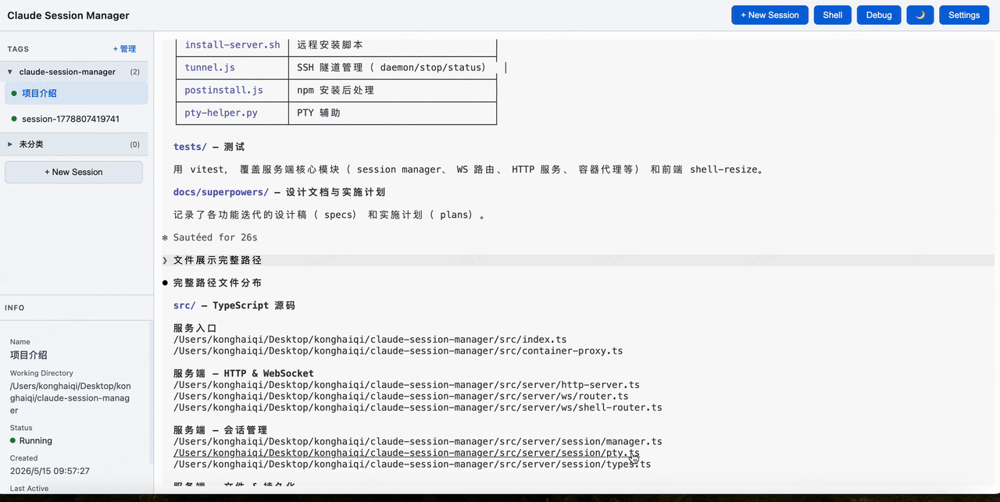
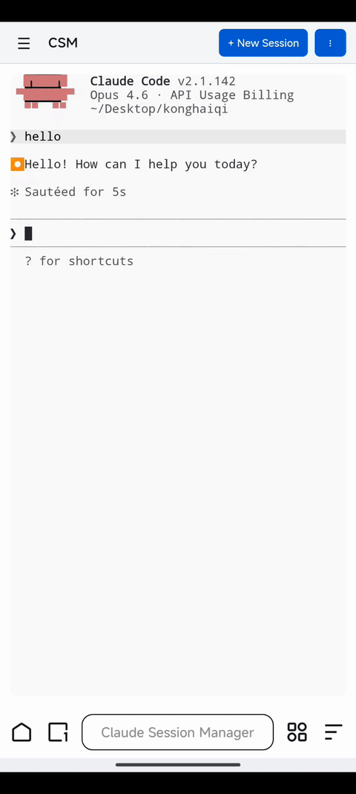

# Claude Session Manager (CSM)

把 Claude Code 的终端会话搬到浏览器里，随时随地通过 Web 管理。

Mac 本地或 Linux 服务器均可部署，手机、平板、电脑通过浏览器访问同一套会话。



## 为什么需要 CSM

Claude Code CLI 和 Agent View 都绑定在本机终端——只能在那台机器上操作，离开终端就看不到会话状态。

CSM 把 Claude Code 会话变成一个 Web 服务：

- **浏览器即入口** — 不依赖本地终端，打开浏览器就能操作 Claude Code 会话
- **远程访问** — 部署在 Linux 服务器上，从任意设备、任意网络访问后台运行的会话
- **文件深度集成** — 终端输出的文件路径可点击，直接在侧边栏编辑器中打开和修改，不用再开额外的编辑器窗口
- **安全可控** — 支持 Basic Auth 认证，可配合 HTTPS 反向代理部署到公网
- **断线不丢** — 关掉浏览器、断开网络，Claude 进程继续在服务端运行。重新打开后会话恢复，对话接续

## 核心功能

**Web 终端** — 基于 xterm.js 的完整终端，支持彩色输出、文件路径点击跳转，效果接近本地终端

**多会话管理** — 同时运行多个 Claude Code 会话，每个会话有独立的工作目录和对话上下文

**Tag 分组** — 会话按自定义 Tag 分组显示，支持展开/收起、右键移动。侧边栏内联管理 Tag 增删改

**内联代码编辑器** — 点击终端中的文件路径，在侧边栏 CodeMirror 编辑器中打开。支持多标签页，按文件类型自动加载语法高亮

**Shell 面板** — 每个会话附带独立 Shell，在会话工作目录下直接执行命令，无需切换窗口

**会话持久化** — 服务端重启后会话自动恢复，支持 `claude --resume` 接续之前的对话上下文

**图片粘贴** — 终端中直接粘贴剪贴板图片，自动上传插入到 Claude 对话

**移动端适配** — 手机浏览器可访问，窄屏下侧边栏自动收为抽屉，终端区域占满全宽



## 快速开始

### Mac 本地运行

前置条件：Node.js 20+，已安装并登录 Claude Code CLI

```bash
git clone https://github.com/Haven-1999/claude-session-manager.git
cd claude-session-manager
npm install
npm run build
npm start
```

启动后浏览器打开输出中的地址（默认 `http://127.0.0.1:9000`）。

#### 手机访问 Mac 本地服务

默认监听 `127.0.0.1`，仅本机可访问。如需从手机浏览器访问，启动时绑定所有网卡：

```bash
npm start -- --host 0.0.0.0
```

然后确保手机与 Mac 连接同一 Wi-Fi，在手机浏览器中访问 Mac 的局域网 IP：

```bash
# 查看 Mac 局域网 IP
ipconfig getifaddr en0
# 例如输出 192.168.1.100，手机浏览器访问 http://192.168.1.100:9000
```

> **注意**：如果 Mac 防火墙阻止了连接，需在「系统设置 → 防火墙 → 选项」中允许 Node.js 的入站连接。

### Linux 服务器运行

```bash
git clone https://github.com/Haven-1999/claude-session-manager.git
cd claude-session-manager
npm install
npm run build
npm start -- --host 0.0.0.0
```

浏览器访问 `http://服务器IP:端口`（端口号以启动日志为准，默认 9000-9099 自动分配）。

> **nvm 用户**：CSM 会自动通过 login shell 解析 `claude` 路径，通常无需手动指定。

### 启动参数

| 参数 | 默认值 | 说明 |
|------|--------|------|
| `--host` / `-h` | `127.0.0.1` | 监听地址 |
| `--port` / `-p` | 自动分配 9000-9099 | 监听端口 |
| `--claude-path` | `claude` | Claude CLI 路径 |
| `--data-dir` | `~/.csm` | 数据目录 |
| `--auth` | 无 | Basic Auth，格式 `user:password` |

## 部署方式

| 方式 | 适用场景 |
|------|---------|
| **Mac 本地** | 管理本机 Claude 会话，浏览器访问 `127.0.0.1` |
| **Linux 直接运行** | 服务器部署，任意设备浏览器访问 |
| **Docker 单容器** | 隔离环境，端口映射到宿主机 |
| **Docker + csm-proxy** | 一台服务器多实例，自动分配端口 |

> **Windows 支持**：目前正在适配中，暂时建议在 Mac 或 Linux 环境下运行。

### Docker 单容器

```bash
docker build -t claude-session-manager .
docker run -d --name csm -p 9090:9090 \
  -v csm-data:/root/.csm \
  -v claude-data:/root/.claude \
  claude-session-manager
```

### Docker 多容器 + csm-proxy

```bash
npm run build
csm-proxy expose --container csm-alice
# 输出: Open: http://SERVER_IP:9137
```

多个容器各占不同主机端口（默认池 9100-9199）。

### SSH 转发（可选）

不想直接开放端口时：

```bash
ssh -N -L 9090:127.0.0.1:9090 user@your-server
# 浏览器访问 http://127.0.0.1:9090
```

## 使用说明

### 创建会话

1. 点击 **+ New Session**
2. 输入会话名称、工作目录（支持 Tab 键补齐）、选择所属 Tag
3. 终端自动打开 Claude Code

### Tag 管理

- 侧边栏顶部点击 **+ 管理** 进入 Tag 管理模式
- 支持新增、重命名、删除 Tag
- 删除 Tag 时可选择将会话移入"未分类"或连同删除
- 右键会话可移动到其他 Tag

### 文件编辑

终端中的文件路径自动变为可点击链接，点击在侧边栏编辑器中打开：
- 绝对路径直接打开
- 相对路径基于会话工作目录解析
- 文件不存在时弹出路径确认

### 会话状态

| 状态 | 颜色 | 含义 |
|------|------|------|
| running | 绿色 | 有客户端连接，Claude 进程运行中 |
| disconnected | 黄色 | 无客户端，Claude 进程在后台继续运行 |
| stopped | 红色 | Claude 进程已退出（点击可 resume 恢复） |

## 架构

```
┌─────────────────────────────────────────────────────────────┐
│  Browser (任意设备 · Safari / Chrome / Edge)                 │
│  - Tag 分组的会话列表                                        │
│  - Terminal panels (WebSocket → PTY)                        │
│  - Code editor sidebar (multi-tab)                          │
└──────────────────────────┬──────────────────────────────────┘
                           │ HTTP / WebSocket
┌──────────────────────────▼──────────────────────────────────┐
│  CSM Node.js Backend (Mac 本机或 Linux 服务器)               │
│  - Express REST API (/api/sessions, /api/tags, /api/files)  │
│  - WebSocket router (terminal I/O, heartbeat, buffer replay)│
│  - node-pty spawns local `claude` process                   │
│  - SQLite persists session & tag metadata                   │
└─────────────────────────────────────────────────────────────┘
```

## 技术栈

- **Backend**: Node.js 20+, TypeScript, Express, ws, node-pty, better-sqlite3
- **Frontend**: Vanilla TypeScript, xterm.js 5.x, CodeMirror 6 (ESM CDN)
- **Storage**: SQLite

## 安全

- 可选 Basic Auth（`--auth user:password`）
- 文件 API 拒绝非绝对路径，防止目录遍历
- 二进制文件拒绝编辑，文件上限 1MB，上传上限 10MB
- 内网 / VPN 可直接访问；公网部署建议配合 HTTPS 反向代理

## 开发

```bash
npm run dev              # 后端 TypeScript 编译监听
npm run build:frontend   # 前端构建
npm test                 # 运行测试
```

## 数据存储

| 路径 | 用途 |
|------|------|
| `~/.csm/sessions.db` | 会话元数据、Tag 数据 |
| `~/.claude/sessions/*.json` | Claude CLI 会话文件 |

## License

MIT
