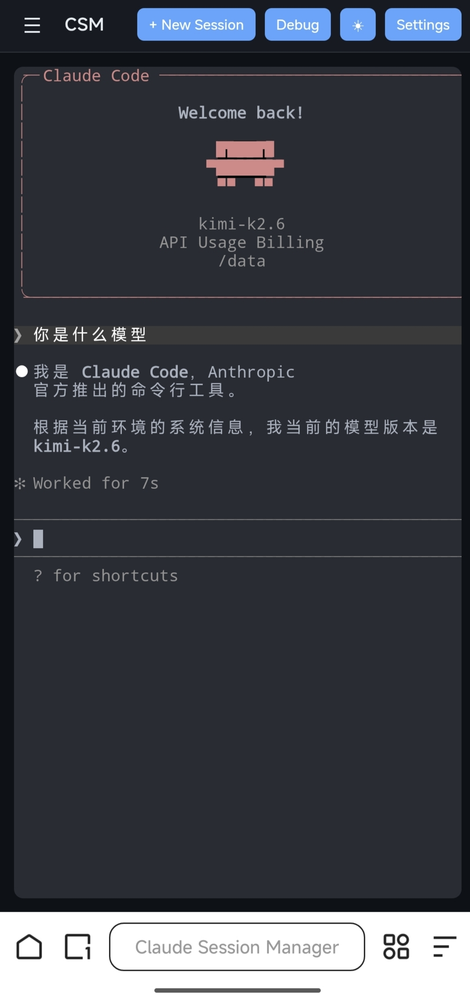

# Claude Session Manager (CSM)

在 Mac 本地或 Linux 服务器上运行 Claude Code 会话管理服务，并通过 Safari、Chrome 等浏览器访问 Web 界面。


## 功能特性

- **多会话管理** — 同时维护多个独立的 Claude Code 会话，每个会话有独立的工作目录和对话上下文
- **Web 终端** — 基于 xterm.js 的完整终端模拟器，支持彩色输出、文件路径点击跳转
- **内联代码编辑器** — 点击终端中的文件路径即可在侧边栏打开 CodeMirror 编辑器，直接修改后端所在机器上的文件
- **会话持久化** — 后端重启后会话列表自动恢复，支持 `claude --resume` 恢复到之前的对话
- **本地或远程浏览器访问** — Mac 本地运行时访问 `127.0.0.1`，Linux 服务器运行时访问服务器地址
- **移动端适配** — 支持手机浏览器访问 Linux 服务器上的 CSM，窄屏下侧边栏自动收为抽屉，终端区域占满全宽
- **实时通知** — Claude 回复完成后自动发送浏览器通知



## 设计特点

### 终端
- 内置 One Dark / One Light 两套主题，字体大小可在 10–22px 之间调节，最小对比度设置为 4.5
- 终端输出的文件路径通过自定义 LinkProvider 识别为可点击链接，支持绝对路径、相对路径以及带空格的路径（引号包裹）
- 每个会话维护一个 500 行的输出缓冲区，WebSocket 断线重连后自动向客户端回放，避免内容丢失

### 代码编辑器
- CodeMirror 6 侧边栏编辑器支持多标签页，标签显示未保存标记，关闭前提示确认
- 按文件扩展名自动加载对应语言包，目前支持 TypeScript、JavaScript、Rust、Python、JSON、HTML、CSS、Markdown、C/C++、Shell、SQL
- 支持 Cmd+S / Ctrl+S 保存，主题随全局设置同步切换深色/浅色

### 连接稳定性
- WebSocket 层实现 35 秒心跳超时检测，客户端断开后按退避策略自动重连
- PTY 进程在最后一个客户端断开时保持运行，新客户端连接后可直接恢复交互，无需等待进程重启
- 每个会话维护输出缓冲区，浏览器断线重连后可回放最近输出，避免短暂网络中断造成内容丢失

### 安全
- 服务端可选 Basic Auth，通过环境变量或启动参数配置
- 文件读写 API 对请求路径做 `path.resolve` 规范化，拒绝非绝对路径，防止目录遍历
- 读取文件时采样前 8KB 内容检测空字节，判定为二进制则拒绝编辑；单文件编辑上限 1MB，上传上限 10MB
- 内网、VPN 或受控服务器环境可直接开放端口访问；公网访问建议配合防火墙白名单、HTTPS、认证或反向代理

### 会话生命周期
- 会话状态分为 `running`（有客户端连接）、`disconnected`（无客户端但 PTY 进程仍在）、`stopped`（PTY 已退出）三种
- 会话元数据、最后活跃时间戳、Claude session ID 通过 SQLite 持久化，服务端重启后自动加载恢复
- 首次启动 PTY 时异步读取 `~/.claude/sessions/<pid>.json` 获取 Claude 内部 session ID，用于后续 `claude --resume`；若 resume 后进程在 3 秒内退出，则判定 session ID 已失效，清空后重新启动新会话

## 架构

CSM 的后端运行在哪台机器上，就管理哪台机器上的 shell、文件和 Claude Code 会话：

```
┌─────────────────────────────────────────────────────────────┐
│  Browser                                                     │
│  Safari / Chrome / Edge                                     │
│  - Session list sidebar                                     │
│  - Terminal panels (WebSocket → PTY)                        │
│  - Code editor sidebar (multi-tab)                          │
└──────────────────────────┬──────────────────────────────────┘
                           │ HTTP / WebSocket
                           │ Mac local: http://127.0.0.1:<port>
                           │ Linux server: http://SERVER_IP:<port>
┌──────────────────────────▼──────────────────────────────────┐
│  Mac 本机或 Linux 服务器                                    │
│  ┌─────────────────────────────────────────────────────┐    │
│  │ CSM Node.js Backend                                 │    │
│  │ - Express REST API (/api/sessions, /api/files)      │    │
│  │ - WebSocket router (input/resize/ping/buffer)       │    │
│  │ - node-pty spawns local `claude` process            │    │
│  │ - SQLite persists sessions + output history         │    │
│  │ - Serves the compiled Web frontend                  │    │
│  └─────────────────────────────────────────────────────┘    │
└─────────────────────────────────────────────────────────────┘
```

## 技术栈

- **Backend**: Node.js 20+, TypeScript, Express, ws (WebSocket), node-pty, better-sqlite3
- **Frontend**: Vanilla TypeScript, xterm.js 5.x, xterm-addon-fit, CodeMirror 6 (ESM CDN)
- **Runtime**: Mac 本地浏览器访问，或 Linux server + browser access from Mac/Windows/Linux

## 快速开始

选择适合你的运行方式：

| 方式 | 适用场景 | 端口行为 |
|------|---------|---------|
| **Mac 本地运行** | 在 Mac 上管理本机目录和本机 Claude 会话 | 默认监听 `127.0.0.1`，自动分配 9000-9099 |
| **Linux 直接运行** | 在服务器上管理服务器目录和 Claude 会话 | 自动分配 9000-9099，也可指定固定端口 |
| **Docker 单容器** | 希望隔离环境，一台服务器一个实例 | 固定映射到宿主机 9090 |
| **Docker + csm-proxy** | 一台服务器多容器/多用户 | 宿主机自动分配 9100-9199，分别代理到各容器 |

### 方式一：Mac 本地运行

前置条件：

- 已安装 Node.js 20+
- 已安装并登录 Claude Code CLI，终端里可以运行 `claude`
- 如 `npm install` 编译原生依赖失败，先安装 Xcode Command Line Tools 后重试

```bash
# 1. 克隆仓库
git clone https://github.com/Haven-1999/claude-session-manager.git
cd claude-session-manager

# 2. 安装依赖
npm install

# 3. 构建
npm run build

# 4. 启动（默认只监听本机 127.0.0.1）
npm start
```

启动成功后会输出实际端口，例如：

```text
CSM listening on http://127.0.0.1:9000
```

浏览器打开输出中的地址即可。Mac 本地运行时，CSM 管理的是 Mac 本机文件、本机 shell 和本机 Claude Code 会话。

如果 `claude` 不在 PATH 中，可以指定 Claude CLI 路径：

```bash
npm start -- --claude-path /path/to/claude
```

### 方式二：Linux 服务器直接运行

```bash
# 1. 克隆仓库
git clone https://github.com/Haven-1999/claude-session-manager.git
cd claude-session-manager

# 2. 安装依赖
npm install

# 3. 构建
npm run build

# 4. 启动（监听所有接口，自动分配可用端口）
npm start -- --host 0.0.0.0
```

启动成功后会输出实际端口，例如：

```text
CSM listening on http://0.0.0.0:9000
```

浏览器打开 `http://服务器IP:9000` 即可（端口号以实际输出为准）。Linux 服务器运行时，CSM 管理的是服务器上的文件、shell 和 Claude Code 会话。

如需指定固定端口：

```bash
npm start -- --host 0.0.0.0 --port 9090
```

> 如果服务器有防火墙，需要放行对应端口。

### 方式三：服务器上运行 Docker（单容器）

```bash
# 启动容器
docker run -d \
  --name csm \
  -p 9090:9090 \
  -v csm-data:/root/.csm \
  -v claude-data:/root/.claude \
  haven1999/claude-session-manager:latest
```

浏览器访问 `http://服务器IP:9090`。

> **重要**：必须同时挂载 `csm-data`（CSM 数据库）和 `claude-data`（Claude 会话文件），否则容器重启后会话丢失。

### 方式四：Docker 多容器 + csm-proxy（一台服务器多实例）

当同一台服务器需要运行多个 CSM 容器时，每个容器内部仍监听 `9090`，由 `csm-proxy` 在宿主机分配独立的外部端口：

```bash
# 在宿主机上执行
npm run build
csm-proxy expose --container csm-alice
```

默认端口池 `9100-9199`，成功后会输出类似：

```text
Container: csm-alice
Target: 172.17.0.2:9090
Host port: 9137
Open: http://SERVER_IP:9137
```

浏览器访问 `http://SERVER_IP:9137` 即可。多个容器同时使用时每个实例占用不同的主机端口，容器内部仍可统一监听 `9090`。

如需使用其他端口池：

```bash
csm-proxy expose --container csm-bob --port-range 9200-9299
```

## 访问方式说明

### Mac 本地访问

如果 CSM 后端是在 Mac 本机通过 `npm start` 启动的，浏览器打开启动日志里输出的 `127.0.0.1` 地址即可，例如：

```text
http://127.0.0.1:9000
```

这种模式下，会话、文件编辑、shell 命令和 Claude Code 都运行在 Mac 本机，不会连接 Linux 服务器。

### Mac 访问 Linux 服务器

如果 CSM 后端是在 Linux 服务器上启动的，Mac 只作为浏览器客户端访问服务器地址。

例如服务器 IP 是 `192.168.1.20`，自动分配的端口是 `9000`：

```text
http://192.168.1.20:9000
```

访问前检查：

- Linux 服务器上的 CSM 已启动（输出形如 `CSM listening on http://0.0.0.0:9000`）
- Mac 和 Linux 服务器网络互通
- 服务器防火墙已允许可信来源访问对应端口

直接开放端口适合内网、VPN 或受控服务器环境。如果需要公网访问，建议后续增加 HTTPS、访问控制或反向代理配置。

### 可选：不开放端口时使用 SSH 转发

如果不希望服务器直接开放端口，可以在 Mac 上手动建立 SSH 转发：

```bash
ssh -N -L 9090:127.0.0.1:9090 user@your-server
```

然后浏览器打开：

```text
http://127.0.0.1:9090
```

这是 Linux 服务器访问路径的可选方式，不是 Mac 本地运行路径。

## 使用说明

### 创建会话

1. 点击顶部 **+ New Session**
2. 输入会话名称和工作目录（默认 `/tmp`）
3. 终端区域会自动打开 Claude Code，开始对话

### 文件编辑

终端中输出的文件路径（绝对或相对）会自动变成可点击链接：
- 点击绝对路径：`/data/repo/src/main.rs` → 直接打开
- 点击相对路径：`src/wifi/seedpace_sources.c` → 基于当前 session 的 cwd 解析
- 如果文件不存在，会弹出路径确认对话框

### 会话状态

| 状态 | 颜色 | 含义 |
|------|------|------|
| running | 绿色 | 有客户端连接，Claude 进程运行中 |
| disconnected | 黄色 | 无客户端连接，Claude 进程仍在运行 |
| stopped | 红色 | Claude 进程已退出 |

**stopped 的会话可以恢复**：点击后 CSM 会执行 `claude --resume <claude_session_id>` 恢复到之前的对话上下文。

## 开发

```bash
# 启动开发服务器（热重载 TypeScript）
npm run dev

# 另一个终端启动前端构建监听
npm run build:frontend

# 运行测试
npm test
```

## 数据存储

| 路径 | 用途 | 是否必须持久化 |
|------|------|--------------|
| `~/.csm/sessions.db` | CSM 会话列表 + 输出历史 | 是 |
| `~/.claude/sessions/*.json` | Claude CLI 会话元数据 | 是 |

## 已知问题

1. **xterm.js 初始化** — 容器必须在可见状态下调用 `terminal.open()`，否则退化为纯文本显示
2. **Claude session ID 映射** — CSM UUID 和 Claude 内部 session ID 是独立系统。首次启动时异步读取 `~/.claude/sessions/<pid>.json` 建立映射，如读取超时则本次无法 resume

## License

MIT
